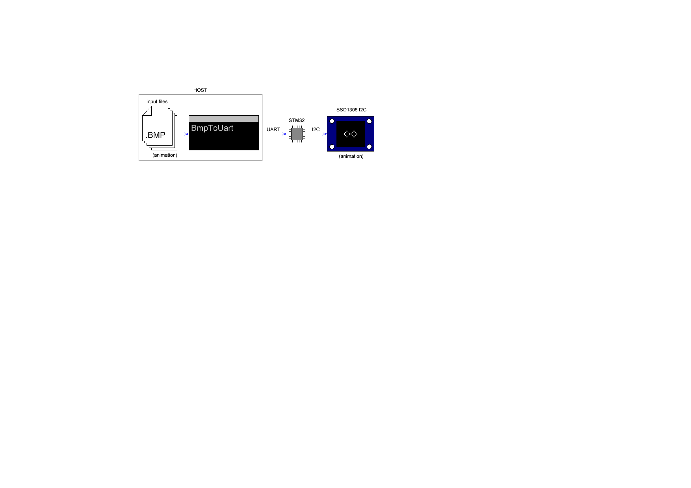
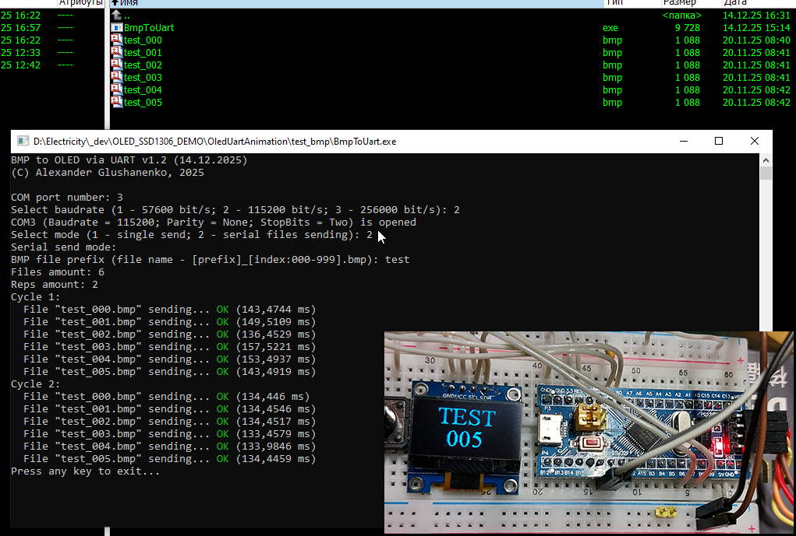

# Host2OledBmpTransfer
Software for sending image files from the host via UART to the MCU + firmware for receiving and rendering to SSD1306-based OLED display. 

  

## Compiled with
MCU firmware: Keil uVision v5.29.0.0 
Host side: MS Visual Studio 2019 

## Hardware
MCU: STM32F103C8 (BluePill board) 
Display: SSD1306-based OLED 128x64 
Host<>MCU: UART link (CP2102 or similar) 
Prorgammer: ST-Link v2 
